1. Εισαγωγή
===========

Οι μετρήσεις από τα συστήματα WearDC και MaintNode αυτόματα αποθηκεύονται στο λογισμικό Mechbase.

Χρησιμοποιώντας ένα μοντέρνο αλλά οικείο περιβάλλον χρήσης, μπορείτε να έχετε συνολική εικόνα της εγκατάστασης. Αναφορές με συμβουλές από ειδικούς μπορούν να παραχθούν εύκολα.

Το λογισμικό είναι σχεδιασμένο γύρω από την πρακτική Role Based Access Control – RBAC που σημαίνει ότι κάθε χρήστης έχει τα δεδομένα που πραγματικά χρειάζεται.

Βασική δυνατότητα του Mechbase είναι η υποστήριξη σημάτων υψηλού ρυθμού δειγματοληψίας. Οι μετρήσεις αυτές μπορούν να 'κατέβουν' με ευκολία, έτσι ώστε να αναλυθούν από επαγγελματίες αναλυτές.

Χρησιμοποιούνται μοντέρνες και αξιόπιστες τεχνολογίες και μια πανίσχυρη βάση SQL.

Το λογισμικό υποστηρίζει RESTful επικοινωνία για να αλληλοεπιδρά με άλλα συστήματα και να μεταβιβάζει πληροφορίες με Λογισμικά Διαχείρισης της Συντήρησης – CMMS και Business Analytics.

1.1 Dashboard
^^^^^^^^^^^^^^

Η αρχική οθόνη της εφαρμογής, μετά την οθόνη εισαγωγής, ονομάζεται dashboard.

Πατώντας τη λέξη 'Mechbase' από οποιαδήποτε οθόνη, ο χρήστης μεταφέρεται στην οθόνη dashboard.

1.2 Πλοήγηση
^^^^^^^^^^^^

1.2.1 Δενδρικό διάγραμμα εγκατάστασης
---------------------------------------

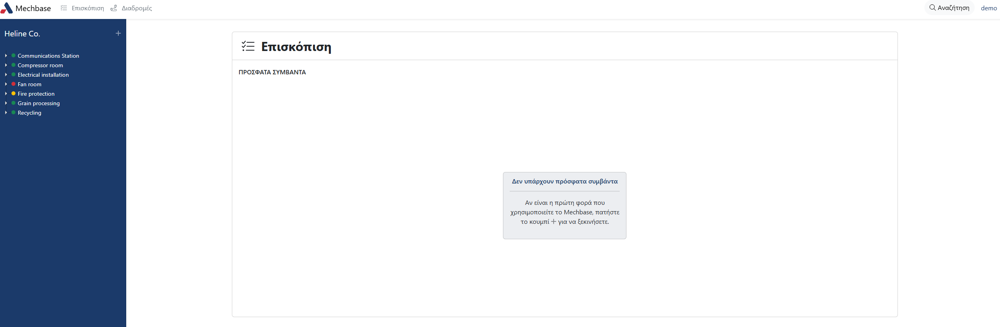

Στο πλήρες δένδρο παρουσιάζονται με ιεραρχία αρχικά η εγκατάσταση και στη συνέχεια τα επιμέρους τμήματα αυτής.

Στο εκάστοτε τμήμα της εγκατάστασης βρίσκονται οι εξοπλισμοί του τμήματος και τα μετρητικά σημεία του κάθε εξοπλισμού.

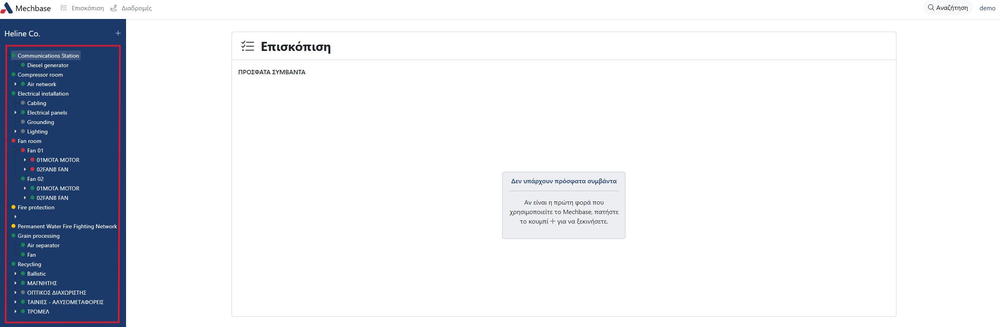

1.2.2 Επίπεδα εγκατάστασης (Τοπολογίες/Εξοπλισμοί)
--------------------------------------------------

Μέσω του δενδρικού διαγράμματος περιηγηθείτε στον επιθυμητό εξοπλισμό.

Αρχικά αντικρίζετε το όνομα και τη διαδρομή μέσα στο εργοστάσιο.

Στο μεσαίο μέρος της σελίδας βλέπετε τα Σημεία μέτρησης, εφόσον υπάρχουν.

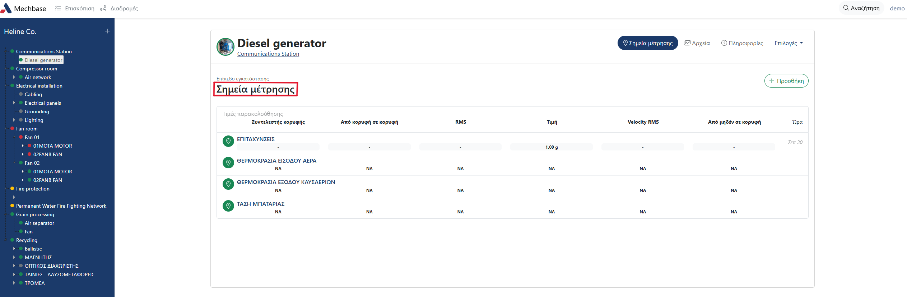

Επιλέγοντας ένα σημείο μέτρησης μεταφερόσαστε στη σελίδα του σημείου.

1.2.3 Σημείο μέτρησης
---------------------

Αρχικά αντικρίζετε το όνομα, τη διαδρομή μέσα στο εργοστάσιο, το χρονικό εύρος που επιθυμούμε να λάβουμε τις μετρήσεις και τυχών εικόνες του επιπέδου της εγκατάστασης.

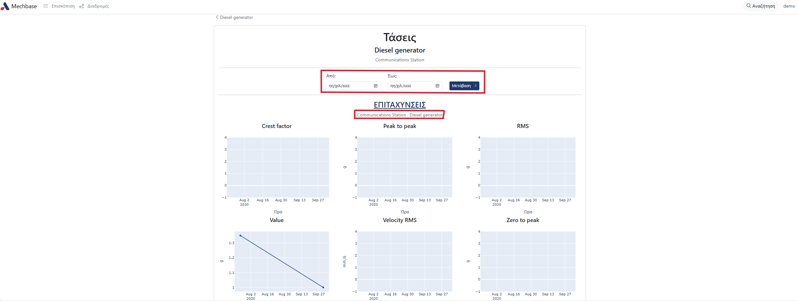

Στο κάτω μέρος της σελίδας παρουσιάζονται οι τιμές παρακολούθησης.

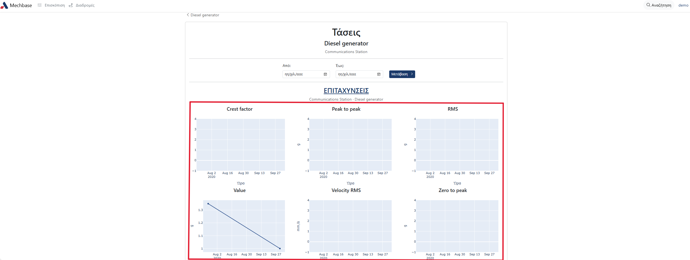

1.3 Σύνδεση-Αποσύνδεση
^^^^^^^^^^^^^^^^
Ο χρήστης μπορεί να αποσυνδεθεί από την εφαρμογή από οποιαδήποτε οθόνη και αν βρίσκεται κάνοντας κλικ στο όνομα χρήστη πάνω δεξιά και στη συνέχεια στο 'Αποσύνδεση'.

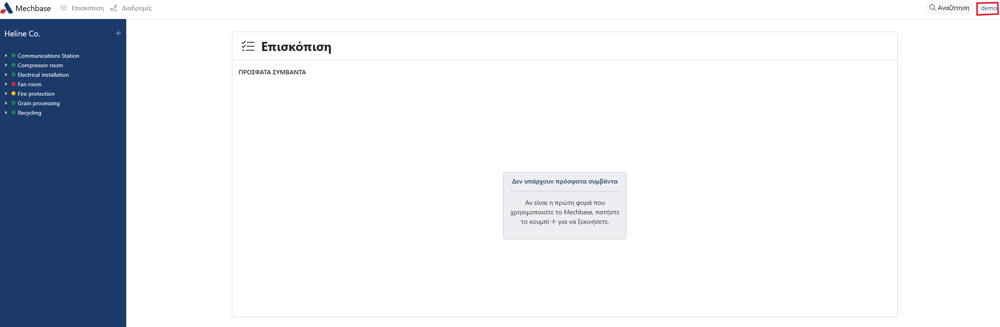
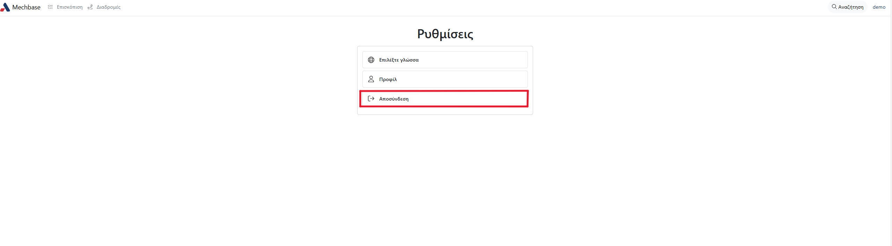

Για να ξανασυνδεθείτε μεταβείτε στη σελίδα της εφαρμογής, εισάγετε το Όνομα χρήστη και το Συνθηματικό και κάντε κλικ στο 'Σύνδεση'.

1.4 Users
^^^^^^^^^
Βήματα για την δημιουργία νέου USER:

Είσοδος στο django administration.

*Για την είσοδο στη συγκεκριμένη σελίδα πρέπει να είστε administrator του συστήματος*.

Κάνετε click στο User.

Αφού έχετε μεταφερθεί στη λίστα με όλους τους Users κάνετε click στο κουμπί 'ADD USER'.

Στην συνέχεια εισάγετε Username και Password και κάνετε κλικ στο κουμπί 'Save and continue editing'.

Έχετε μεταφερθεί στο configuration page του user. Σκρολάρετε προς τα κάτω και πηγαίνετε στην κατηγορία Permissions στο πεδίο User permissions.

Στο πεδίο filter πληκτρολογείτε την λέξη 'measurements' και κάνετε κλικ στο κουμπί 'Choose all'.

Κάνετε τη ίδια διαδικασία και για την λέξη 'routes'.

Τέλος κάνετε 'SAVE'.

1.5 Groups
^^^^^^^^^^

Βήματα για την επιλογή permissions ενός group:

Είσοδος στο django administration.

*Για την είσοδο στη συγκεκριμένη σελίδα πρέπει να είστε administrator του συστήματος*.

Κάνετε click στο 'Groups' και στη συνέχεια το 'ADD GROUP'.

.. image:: Groups/Groups-2.png

Στη νέα σελίδα που θα εμφανιστεί, πληκτρολογείτε το όνομα του group στο κενό πεδίο, και επιλέγετε τα permissions που θέλετε να έχει.
Κλικάρετε 'Choose all' για να διαλέξετε όλα τα permissions, ή κάνετε διπλό κλικ σε ένα ή περισσότερα permissions από τη λίστα. Για να δείτε όλα τα διαθέσιμα permissions, σκρολάρετε προς τα κάτω.

Αφού έχετε επιλέξει τα permissions, κλικάρετε 'Save and add another' αν θέλετε να προσθέσετε και άλλο group, 'Save and continue editing' αν θέλετε να αποθηκεύσετε τις αλλαγές αλλά επιθυμείτε να επεξεργαστείτε πάλι το παρόν group, ή save για αποθήκευση.

.. image:: Groups/Groups-4.png

*Επιλογή permissions ενός group σε ένα επίπεδο εγκατάστασης*

Περιηγηθείτε μέσω του Mechbase στο επίπεδο εγκατάστασης για το οποίο θέλετε να βάλετε permissions, και αντιγράψτε το τελευταίο μέρος του συνδέσμου που που αποτελείτε από αριθμούς και γράμματα.

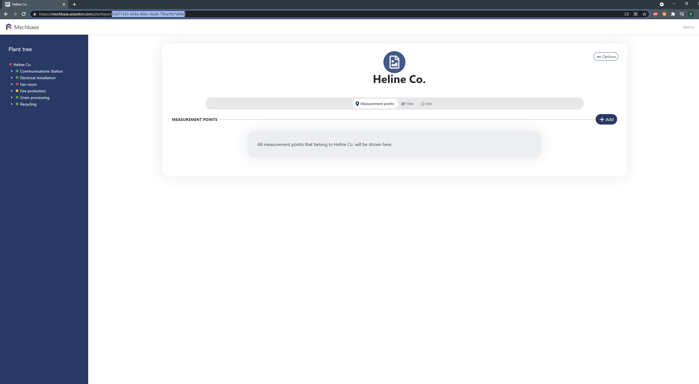

Στη συνέχεια, κάντε εισαγωγή στο django adminitration και κλικάρετε το 'Plant layers'.

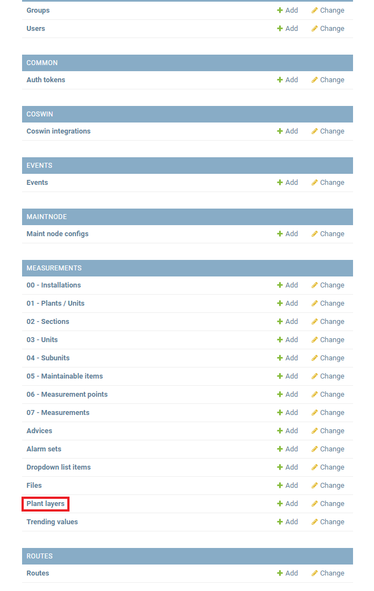

Στη νέα σελίδα που θα εμφανιστεί, κάντε επικόλληση το κομμάτι του συνδέσμου που αντιγράψατε στο κενό πεδίο και κλικάρετε το 'Search'.

Κλικάρετε το επίπεδο εγκατάστασης που θα εμφανιστεί.

Στη σελίδα που θα εμφανιστεί, κάντε κλικ στο 'OBJECT PERMISSIONS'.

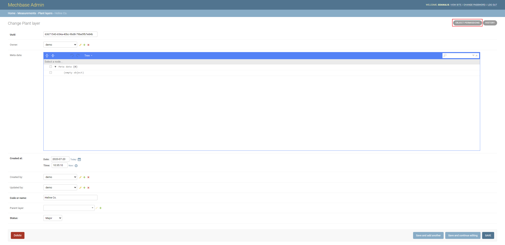

Προσθέτετε το όνομα του γκρούπ στο κενό πεδίο, και κλικάρετε 'Manage group'.

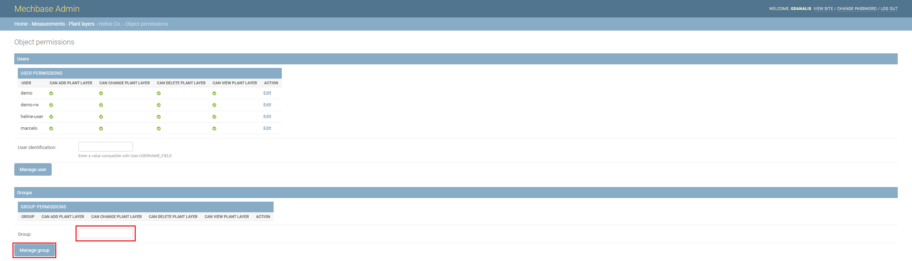

Τέλος, στη νέα σελίδα επιλέξτε 'Choose all' για να επιλέξετε όλα τα permissions του group για το επίπεδο εγκατάστασης, ή κάντε διπλό στα permissions που επιθυμείτε και κλικάρετε 'Save'.

