3. Σημεία Μέτρησης
==================

3.1 Δημιουργία σημείου μέτρησης
-------------------------------

Επιλέγετε το επίπεδο στο οποίο θέλετε να δημιουργήσετε ένα σημείο μέτρησης, είτε από το δέντρο είτε από την αρχική σελίδα της πλατφόρμας.

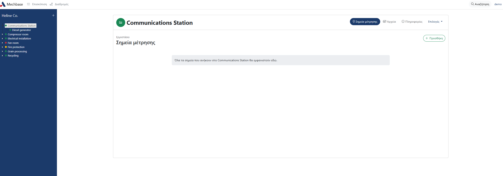

Κλικάροντας "Προσθήκη" στην νέα οθόνη, εμφανίζεται η φόρμα δημιουργίας σημείου μέτρησης.

**Φόρμα δημιουργίας σημείου μέτρησης**

Γενικά
******

* **Name:** Όνομα σημείου. Είναι ελεύθερο πεδίο. Προτείνεται ονομασία βάσει τυποποίησης MIMOSA ή βάσει του συστήματος οργάνωσης που χρησιμοποιείτε.

* **Instructions:** Οδηγίες για τη σωστή εκτέλεση της μέτρησης. Εμφανίζονται στην εφαρμογή κατά τη μέτρηση.

* **Measurement type:** Το είδος του αισθητήρα / μέτρησης.

   * Single axis accelerometer: Επιταχυνσιόμετρο μονού άξονα

   * Triaxial accelerometer: Επιταχυνσιόμετρο τριών διαστάσεων

   * Single axis accelerometer with internal integration: Επιταχυνσιόμετρο με ενσωματωμένο ολοκληρωτή (ταχύτητας, μετατόπισης)
  
   * Current: Ρεύμα
   
   * Displacement probe: Απόκλισης
  
   * Displacement probe used as a phase reference: Απόκλισης για εύρεση φάσης
  
   * Operating hours: Ώρες λειτουργίας
  
   * Linear voltage differential transformer: Γραμμικός διαφορικός μετασχηματιστής
  
   * Lubrication: Λίπανσης
   
   * Microphone: Μικρόφωνο
  
   * Magnetic pickup: Μαγνητικός αισθητήρας
  
   * Multiple sensors: Πολλαπλοί αισθητήρες (ταυτόχρονα) 
  
   * Optical boolean (true/false): Οπτικό Ναι/Όχι
  
   * Optical pickup (shaft speed/phase reference): Οπτική αναφορά ταχύτητας, φάσης
  
   * Optical numerical: Νούμερο
   
   * Optical image: Εικόνα
   
   * Optical free text: Ελεύθερο κείμενο
  
   * Pressure dynamic sensor: Δυναμική πίεση
  
   * Pressure static sensor: Στατική πίεση
   
   * Tachometer: Ταχόμετρο
   
   * Thermography: Θερμογραφία
  
   * Temperature sensor: Θερμοκρασία
   
   * Ultrasound: Υπέρηχος
  
   * Voltage: Τάση

* **Measurement point order:** Η σειρά με την οποία το σημείο μέτρησης θα βρίσκεται μέσα σε μια διαδρομή.

**Angular orientation, Axis direction και Direction of motion**

Το λογισμικό υποστηρίζει το σύστημα τυποποιημένης οργάνωσης σημείων μέτρησης Mimosa Standard.

Τα πεδία Angular orientation, Axis direction και Direction of motion απαντώνται σε αυτή την τυποποίηση και η συμπλήρωσή τους προτείνεται αλλά δεν είναι απαραίτητη.

**Angular orientation**

* Οριζόντιες μηχανές - Ο γωνιακός προσανατολισμός ενός αισθητήρα δονήσεων μετράται από τη μηδενική αναφορά που βρίσκεται στις 3 η ώρα ρολογιού κοιτάζοντας τη μηχανή απο το πίσω μέρος της. Δηλαδή το 000 στην παρακάτω εικόνα.

* Κάθετες μηχανές - Η αναφορά μηδενός βρίσκεται στην κατεύθυνση ροής με γωνιακό προσανατολισμό που μετριέται αριστερόστροφα στο επίπεδο περιστροφής του άξονα όταν το κοιτάζουμε από πάνω (θέση 001) προς τα κάτω στην παρακάτω εικόνα.

**Αxis direction:** 

* Radial - Ο άξονας αισθητήρα είναι κάθετος προς και διέρχεται από τον άξονα.

* Axial - Ο άξονας αισθητήρα είναι παράλληλος προς τον άξονα. 

* Tangential - Ο άξονας αισθητήρα είναι κάθετος σε έναν ακτινικό στο επίπεδο περιστροφής του άξονα.

* Horizontal - Ο άξονας αισθητήρα βρίσκεται μόνο σε 000 ή 180 μοίρες. 

* Vertical - Ο άξονας αισθητήρα βρίσκεται μόνο σε 090 ή 270 μοίρες.

**Direction of motion:**

* Ο αξονικός αισθητήρας που βρίσκεται πλησιέστερος προς το άκρο αναφοράς του συστήματος μηχανήματος, θέση 001, ονομάζεται κανονικός (Νormal) όταν τοποθετηθεί έτσι ώστε η θετική κίνηση προς τον μετατροπέα να παράγει μια θετική έξοδο σήματος.

* Η κίνηση προς το άκρο αναφοράς θα παράγει ένα αρνητικό σήμα από τον αξονικό μετατροπέα στο αντίθετο άκρο, ο οποίος ονομάζεται αντίστροφος (Reverse).

Acquisition settings
********************

**Για υψηλής ανάλυσης σήματα**

Για τους αισθητήρες επιταχύνσεων, τάσης, έντασης και υπερήχων συνήθως θέλουμε να καταγράψουμε χρονοσειρά για περαιτέρω ανάλυση του σήματος.

Οι παρακάτω ρυθμίσεις αφορούν τη δυνατότητα αυτή.

* **Reference (V):** Το προτιμόμενο εύρος του συστήματος δειγματοληψίας σε μονάδες τάσης.

* **FFT Lines:** Οι γραμμές FFT.

* **Maximum frequency (RPM):** H μέγιστη συχνότητα σε RPM.

* **Sampling rate (Auto, Hz):** O δείκτης δειγματοληψίας, υπολογίζεται αυτόματα σε Hz.

* **Sampling duration (Auto, s):** O χρόνος δειγματοληψίας, υπολογίζεται αυτόματα σε δευτερόλεπτα.

* **Settling time (s):** O χρόνος αναμονής πριν την έναρξη της μέτρησης σε δευτερόλεπτα.

**Για οποιοδήποτε σήμα**

Το αποτέλεσμα της μέτρησης από την κάρτα δειγματοληψίας των οργάνων εξάγεται από την εξίσωση:

.. math::

    Final = Voltage * \frac{1000}{Sensitivity} + Offset

* **Sensitivity (mV/unit):** Η ευαισθησία του σήματος.

* **dB Reference (V):** Τα dB αναφοράς (για μεγέθη σε dB).

* **Offset (V):** Η απόκλιση.

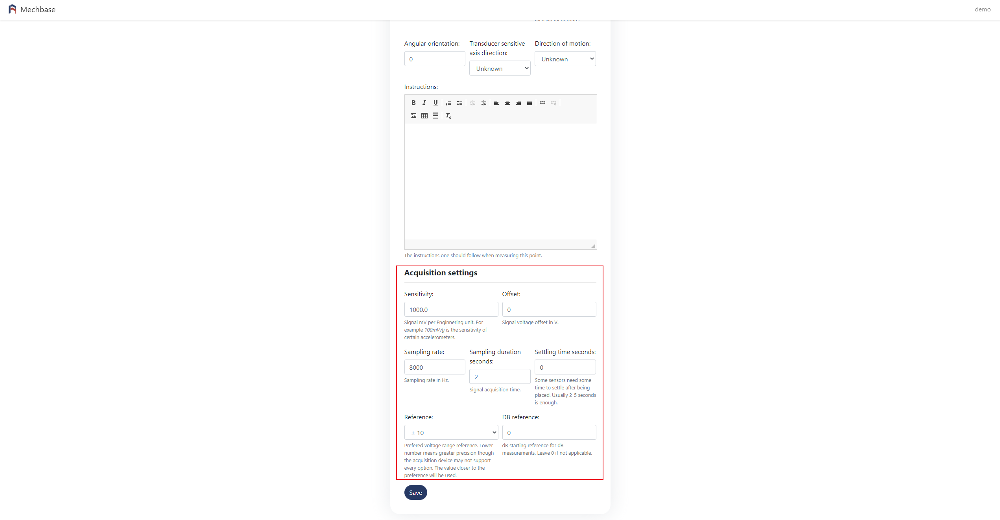

Όταν έχετε ολοκληρώσει την εισαγωγή των στοιχείων, κλικάρετε "Αποθήκευση" στο τέλος της φόρμας.

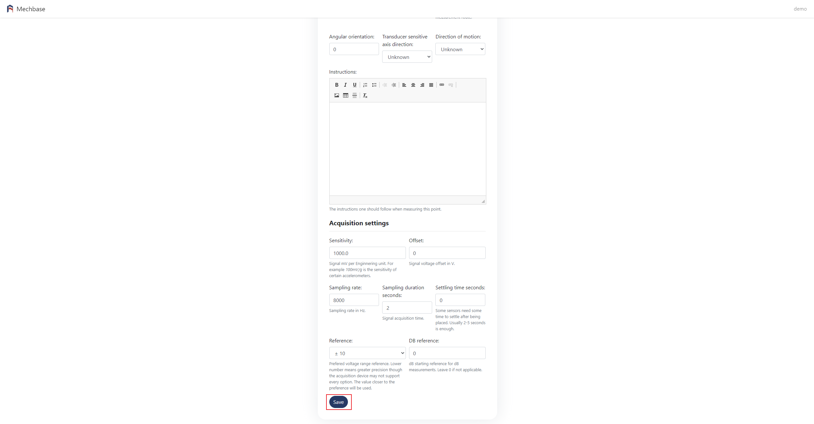

3.2 Επεξεργασία σημείου μέτρησης
--------------------------------

Επιλέγετε και κλικάρετε το επίπεδο με το σημείο μέτρησης που θέλετε να επεξεργαστείτε, είτε από το δέντρο είτε από την αρχική σελίδα της πλατφόρμας.

Στην οθόνη που εμφανίζεται, κλικάρετε στο όνομα του σημείου μέτρησης που θέλετε να επεξεργαστείτε.

.. image:: Measurement-point/Edit_measurement_point_1.png

Κλικάρετε στο "Επιλογές" που εμφανίζεται στο δεξί μέρος της οθόνης και στη συνέχεια στο "Επεξεργασία".

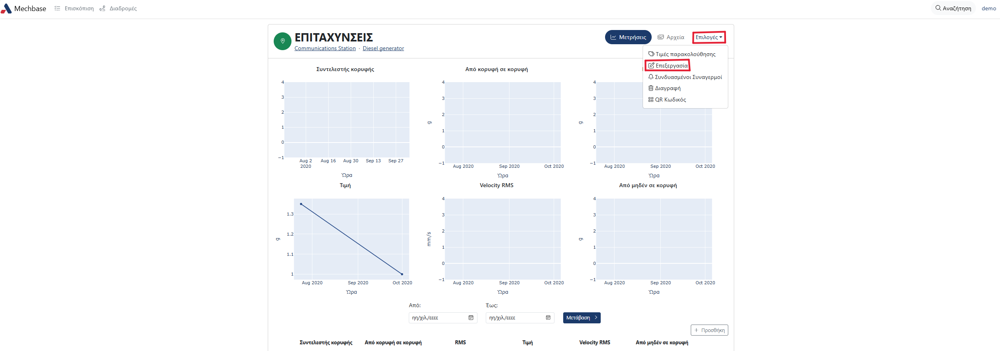

Στη φόρμα που εμφανίζετε, αλλάζετε τα στοιχεία που θέλετε και κλικάρετε "Αποθήκευση".

3.3 Διαγραφή σημείου μέτρησης
-----------------------------

Επιλέγετε και κλικάρετε το επίπεδο με το σημείο μέτρησης που θέλετε να διαγράψετε, είτε από το δέντρο είτε από την αρχική σελίδα της πλατφόρμας.

Στην οθόνη που εμφανίζεται, κλικάρετε το σημείο μέτρησης που θέλετε να διαγράψετε.

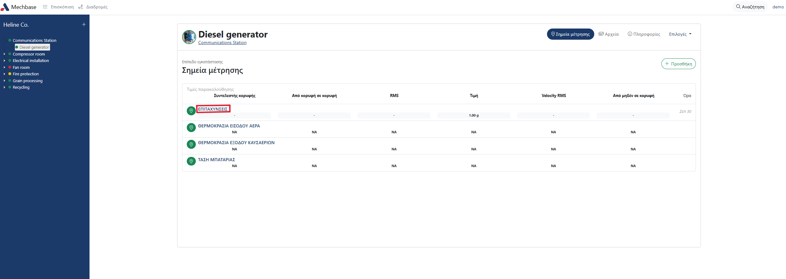

Στην οθόνη που εμφανίζεται, κλικάρετε στο "Επιλογές" και στη συνέχειά στο "Διαγραφή".

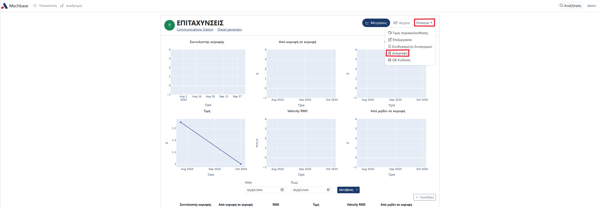

Στο παράθυρο που θα εμφανιστεί, στο πάνω μέρος της σελίδας σας ρωτάει αν είσαστε σίγουροι οτι θέλετε να διαγράψετε το σημείο, κλικάρετε "Ναι, παρακαλώ να διαγραφεί". Σε περίπτωση που δεν θέλετε να το διαγράψετε, πατάτε το βελάκι που σας μεταφέρει στην προηγούμενη οθόνη.

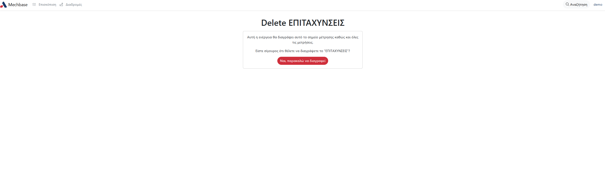

3.4 Trending Values
-----------------------------

Συχνά μας ενδιαφέρει να παρακολουθούμε κάποια χαρακτηριστικά ενός σήματος υψηλής ανάλυσης όπως επιταχύνσεων, υπερήχων ή ρεύματος.

Η συγκεκριμένη λειτουργία επιτρέπει αυτή την παρακολούθηση.

Μπορούμε να ορίσουμε αυτοματοποιημένους υπολογισμούς για κάθε νέα μέτρηση που θα έχουν τις παρακάτω επιλογές.

* **Name:** Το όνομα της τιμής μέτρησης (πχ. RMS 500-700 Hz).

* **Integration:** Η ολοκλήρωση. Επιλογές: No, First (Speed), Second (Displacement).

* **Detection:** Η ανίχνευση της τιμής. Επιλογές: RMS, Crest Factor, Peak to Peak, True Peak, FFT bin.

* **Units:** Οι μονάδες μέτρησης.

* **High Pass:** Το υψιπερατό φίλτρο σε Hz.

* **Low Pass:** Το χαμηλοπερατό φίλτρο σε Hz.

Μεταβείτε στο σημείο μέτρησης που σας ενδιαφέρει. Έδω μπορείτε να δείτε τις ήδη υπάρχουσες τιμές παρακολούθησης (trending values) ή να προσθέσετε νέο πατώντας "Προσθήκη".

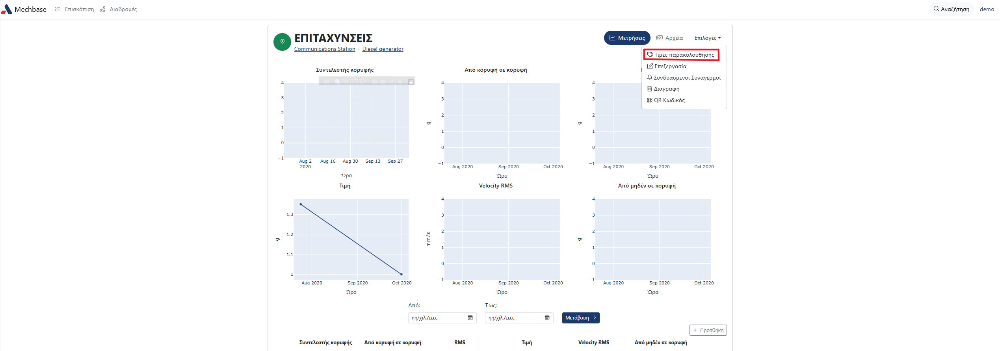

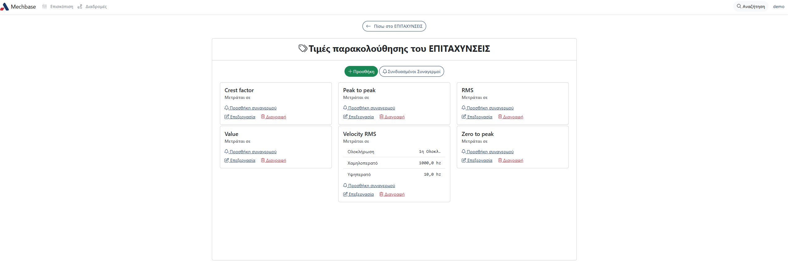

Συμπληρώσετε τα στοιχεία των τιμών παρακολούθησης και κλικάρετε το κουμπί "Αποθήκευση" για να το αποθηκεύσετε. 

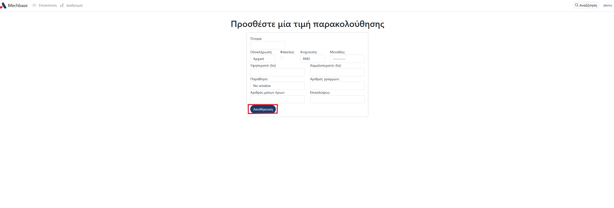

Αν θέλετε να επεξεργαστείτε μία τιμή παρακολούθησης κλικάρετε "Επεξεργασία".

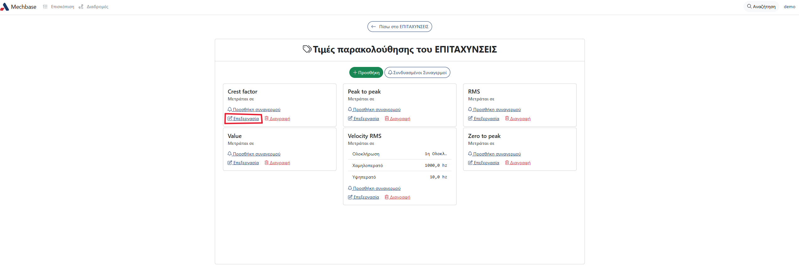

Στη νέα σελίδα που εμφανίζεται, μπορείτε να επεξεργαστείτε τα πεδία των τιμών παρακολούθησης και να αποθηκεύσετε τις αλλαγές σας κλικάροντας "Αποθήκευση". Μπορείτε να διαγράψετε την τιμή παρακολούθησης κλικάροντας "Διαγραφή τιμής παρακολούθησης".

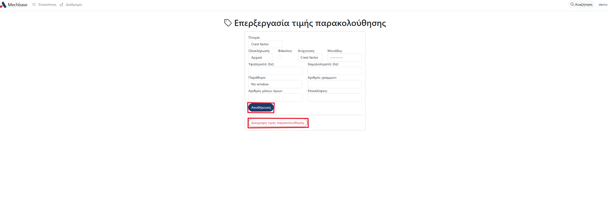

3.5 Συναγερμοί
--------------
Οι συναγερμοί σε ένα πρόγραμμα διαγνωστικής συντήρησης είναι εξαιρετικά κρίσιμοι για την αποδοτικότητα της διαδικασίας. Δείχνουν που πρέπει να επικεντρωθεί η προσοχή του χρήστη.

Αυτό γιατί οι περισσότερες μηχανές σε μία εγκατάσταση δεν παρουσιάζουν προβλήματα. Τελικά αν οι συναγερμοί τεθούν σωστά, ο χρήστης θα ασχοληθεί με τα πάγια που έχουν πραγματικά πρόβλημα.

Simple alarms
*************

Η πιο απλή μέθοδος συναγερμών είναι η σύγκριση τρέχουσας τιμής με την τιμή βάσης.

Ο χρήστης γνωρίζοντας το επίπεδο συναγερμού που θέλει να θέσει, μεταβαίνει στο σημείο μέτρησης και επιλέγει "Τιμές παρακολούθησης". Εκεί κλικάρει "Προσθήκη συναγερμού" και εισέρχεται στην σελίδα, όπου προσθέτει το σετ συναγερμών.

Στη συνέχεια θέτει τους συναγερμούς για κάθε τιμή παρακολούθησης. 

.. image:: Measurement-point/alarms-simple-1.png

Για να επικυρώσει την επιλογή θα επιλέξει **Save**.

Statistical alarms
******************

Μεταβολή όμως στην λειτουργία του εξοπλισμού (ταχύτητα, φορτίο) ή ακόμα και στις περιβαλλοντικές συνθήκες μεταβάλει το μέγεθος που μετράνε οι αισθητήρες που χρησιμοποιούμε δημιουργώντας τον κίνδυνο εμφάνισης ψευδο-συναγερμών. Αυτοί μειώνουν την εμπιστοσύνη στο σύστημα διαγνωστικής συντήρησης που έχει εφαρμοσθεί ενισχύοντας τον κίνδυνο για απόκρυψη της πραγματικής βλάβης.

Η διεθνής κοινότητα της συντήρησης για να καταπολεμήσει το φαινόμενο προτείνει όλο και περισσότερο τη χρήση στατιστικών μεθόδων για την παρακολούθηση του εξοπλισμού. Η στατιστική ανάλυση στην πραγματικότητα εξηγεί πόσο κάτι αποκλίνει από την «κανονική» κατάσταση.

Η μέθοδος στηρίζεται στην έννοια της τυπικής απόκλισης ή σ. Πρόκειται για μία κατανομή των δεδομένων που περιγράφεται οπτικά από την παρακάτω εικόνα:

Οι μετρήσεις που απέχουν μέχρι 1 x σ από το μέσο όρο αποτελούν το 68% των μετρήσεων ενώ οι μετρήσεις που απέχουν μέχρι 2 x σ αποτελούν το 95% των μετρήσεων. Όπως γίνεται κατανοητό δεδομένα ακόμα πιο μακριά από το κέντρο είναι σίγουρα ενδείξεις ότι η μηχανή λειτουργεί όπως εκτός «κανονικότητας».

Στα πλαίσια της διαρκούς βελτίωσης του λογισμικού μας DataRunner προσθέσαμε ένα βοηθό οδηγό για τον ορισμό στατιστικών συναγερμών.

Ο χρήστης έχοντας συλλέξει δεδομένα με όποια από τις υποστηριζόμενες  μεθόδους, μεταβαίνει στο  σημείο μέτρησης. Εκεί θα συναντήσει την επιλογή: **Statistical Alarms**

Στη συνέχεια θα κληθεί να επιλέξει τη μέτρηση στην οποία θα βασιστεί.  Για μετρήσεις ταλαντώσεων αυτό μπορεί να είναι RMS, Peak, Peak-to-Peak, Crest factor επιτάχυνσης/ταχύτητας/μετατόπισης. Αναφορικά με φασματική ανάλυση στατιστικοί συναγερμοί εφαρμόζονται επίσης σε τιμή περιοχής φάσματος.

.. image:: Measurement-point/statistical-alarms-choice.png

Με βάση τις μετρήσεις που επιλέχτηκαν ο οδηγός προτείνει τιμές για τους συναγερμούς. Σε αυτό το σημείο χρήστης ο οποίος γνωρίζει τη συμπεριφορά του μηχανήματος μπορεί αν θέλει να πραγματοποιήσει αλλαγές και τελικά να οριστικοποιήσει τους συναγερμούς.

Για ένα πρόγραμμα διαγνωστικής συντήρησης ο χρόνος που δαπανούμε στον ορισμό των συναγερμών είναι από τις πιο συμφέρουσες δαπάνες σε όλο το πρόγραμμα. Φροντίζουμε οι δαπάνες αυτές να είναι ακόμα μικρότερες βελτιστοποιώντας το αποτέλεσμα.
