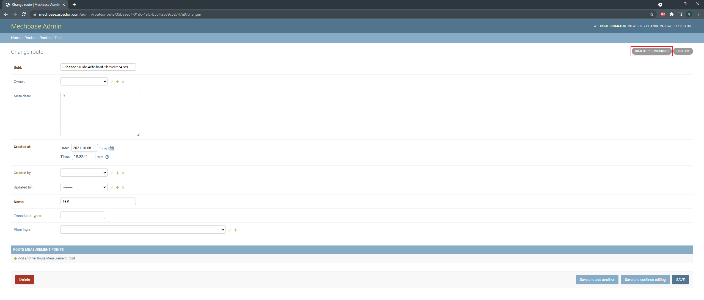
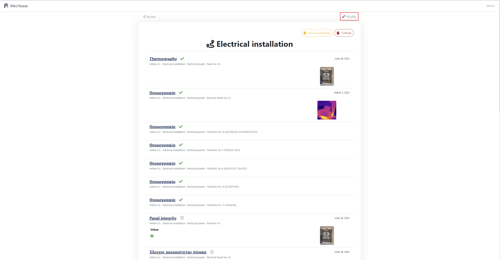

Διαδρομές
=========

Για να δημιουργήσετε routes, πρέπει να κάνετε είσοδο στο django administration.

Κλικάρετε το 'Add', και θα μεταφέρθειτε στην οθόνη δημιουργίας route.

.. image:: Routes/Routes-1.png

Συμπληρώνετε το όνομα(Name) και τουλάχιστον έναν αισθητήρα(Transducer types) π.χ. UL, και κλικάρετε 'Save and add another' αν θέλετε να προσθέσετε και άλλο route, 'Save and continue editing' αν θέλετε να αποθηκεύσετε τις αλλαγές αλλά επιθυμείτε να επεξεργαστείτε πάλι το παρόν route, ή save για αποθήκευση.

.. image:: Routes/Routes-2.png

Αφού αποθηκεύσετε το route, μπορείτε να δώσετε τα permissions που επιθυμείτε κλικάροντας στο 'OBJECT PERMISSIONS'.

Στη συνέχεια, μπορείτε να προσθέσετε permissions είτε για κάποιον user είτε για group πληκρολογόντας το όνομα και κλικάροντας το αντίστοιχο κουμπί.

Στη νέα οθόνη, κάντε διπλό κλικ για να προσθέσετε συγκεκριμένα permissions ή κλικάρετε το "Choose all' για να προσθέσετε όλα τα permissions, και στη συνέχεια 'Save'.

.. image:: Routes/Routes-5.png

Αφού έχετε δημιουργήσει το route, μεταβείτε στο mechbase.arpedon.com/routes και κλικάρετε το όνομα του route.

.. image:: Routes/Routes-6.png

Στη νέα οθόνη, μπορείτε να προσθέσετε τα plant layer του route. Πληκτρολογώντας στο πεδίο τα πρώτα γράμματα του ονόματος του plant layer, εμφανίζεται μια λίστα. Κλικάρετε το layer που επιθυμείτε και θα προστεθεί από κάτω.

Μπορείτε επίσης να βάλετε στη σειρά τα plant layer, κλικάροντας το εικονίδιο αριστερά από το όνομα και κρατώντας το κλικαρισμένο, σύροντας το πάνω η κάτω στη λίστα.

Από το dropdown μπορείτε να προσθέσετε κι' άλλους αισθητήρες κλικάροντας το βελάκι και επιλέγοντας τον αισθητήρα από τη λίστα.

Για να αφαιρέσετε κάποιο αισθητήρα, κλικάρετε πάλι πάνω στο όνομα του αισθητήρα που έχετε προσθέσει. Αν αφαιρέσετε όλους τους αισθητήρες, σημαίνει ότι το route χρησιμοποιεί όλους τους τύπους αισθητήρων.

Τέλος, κλικάρετε 'Update' για να αποθηκευτούν οι αλλαγές σας.

.. image:: Routes/Routes-9.png
