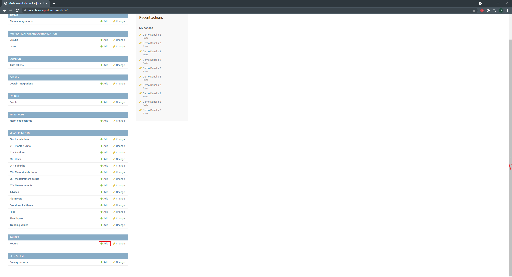
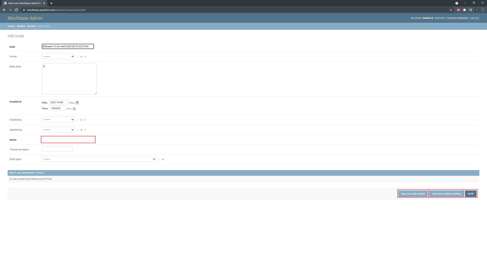
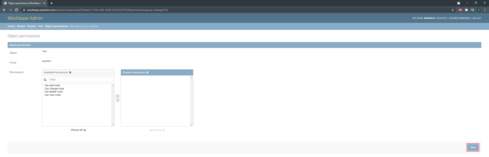
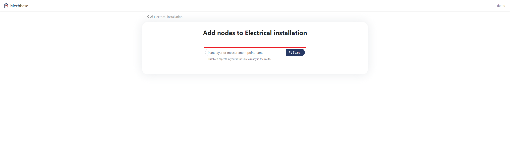

Διαδρομές
=========

Για να δημιουργήσετε routes, πρέπει να κάνετε είσοδο στο django administration.

Κλικάρετε το 'Add', και θα μεταφέρθειτε στην οθόνη δημιουργίας route.

Συμπληρώνετε το όνομα(Name), και κλικάρετε 'Save and add another' αν θέλετε να προσθέσετε και άλλο route, 'Save and continue editing' αν θέλετε να αποθηκεύσετε τις αλλαγές αλλά επιθυμείτε να επεξεργαστείτε πάλι το παρόν route, ή save για αποθήκευση.

Αφού αποθηκεύσετε το route, μπορείτε να δώσετε τα permissions που επιθυμείτε κλικάροντας στο 'OBJECT PERMISSIONS'.

.. image:: Routes/Routes-3.png

Στη συνέχεια, μπορείτε να προσθέσετε permissions είτε για κάποιον user είτε για group πληκρολογόντας το όνομα και κλικάροντας το αντίστοιχο κουμπί.

.. image:: Routes/Routes-4.png

Στη νέα οθόνη, κάντε διπλό κλικ για να προσθέσετε συγκεκριμένα permissions ή κλικάρετε το "Choose all' για να προσθέσετε όλα τα permissions, και στη συνέχεια 'Save'.

Αφού έχετε δημιουργήσει το route, μεταβείτε στο mechbase.arpedon.com/routes και κλικάρετε το όνομα του route.

Στη νέα οθόνη, μπορείτε να δείτε τα σημεία μέτρησης του route. Κλικάροντας το κουμπί "Modify" μπορείτε να επεξεργαστείτε το route.

.. image:: Routes/Routes-7.png

Κλικάροντας το εικονίδιο δεξιά από το όνομα του σημείου μέτρησης μπορείτε να το αφαιρέσετε από το route.

Μπορείτε επίσης να βάλετε στη σειρά τα plant layer, κλικάροντας το εικονίδιο αριστερά από το όνομα και κρατώντας το κλικαρισμένο, σύροντας το πάνω η κάτω στη λίστα.

Κλικάροντας το κουμπί "Add" μπορείτε να προσθέσετε σημεία μέτρησης στο route.

.. image:: Routes/Routes-8.png

Πληκτρολογήστε το όνομα του σημείου μέτρησης ή επιπέδου εγκατάστασης που θέλετε και στη συνέχεια πατήστε "Search".

Πατήστε "Select points" αν θέλετε να δείτε τα σημεία μέτρησης του επιπέδου εγκατάστασης και στη συνέχεια να προσθέσετε κάποιο από αυτά στο route. 

Πατήστε "Add to route" για να προσθέσετε ένα σημείο μέτρησης στο route.

.. image:: Routes/Routes-10.png

.. image:: Routes/Routes-11.png