2. Δομή
=======

2.1 Δημιουργία νέου επιπέδου εγκατάστασης
^^^^^^^^^^^^^^^^^^^^^^^^^^^^^^^^^^^^^^^^^

Περιηγηθείτε στο επίπεδο το οποίο θα είναι "πρόγονος" του νέου επιπέδου. 

Από το μενού κλικάρετε "Νέο επίπεδο".

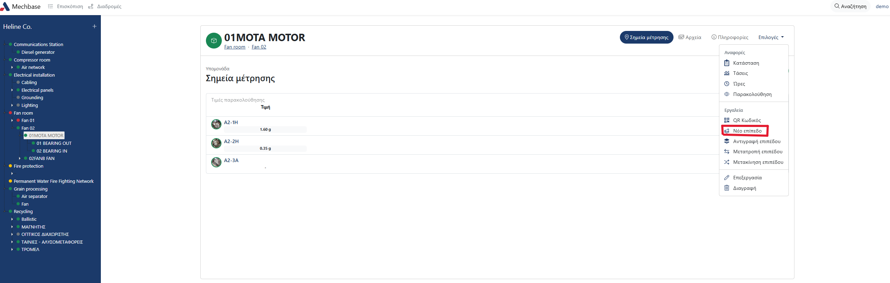

Επιλέξτε τον τύπο επιπέδου που θέλετε να δημιουργήσετε.

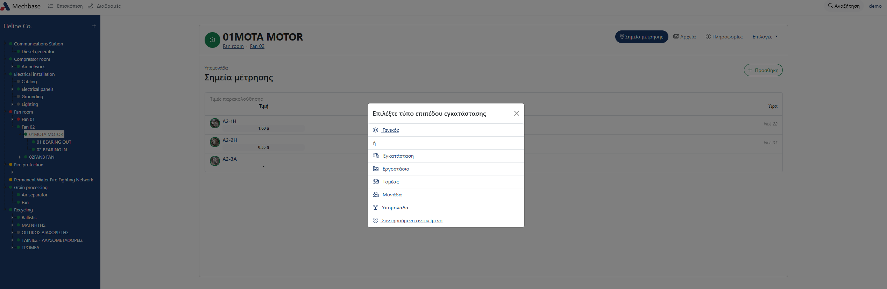

Συμπληρώνετε το όνομα "Κωδικός ή όνομα" και τον "Γονέα".

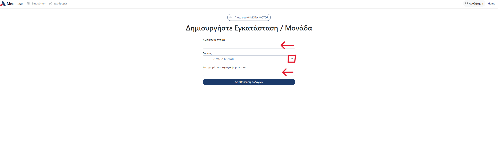

Μόλις τα συμπληρώσετε κλικάρετε "Αποθήκευση αλλαγών".

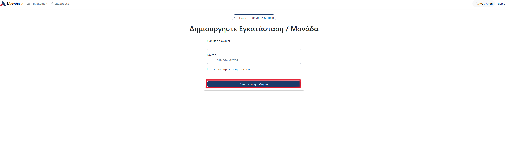

Από το δέντρο περιηγείστε στο νέο επίπεδο.

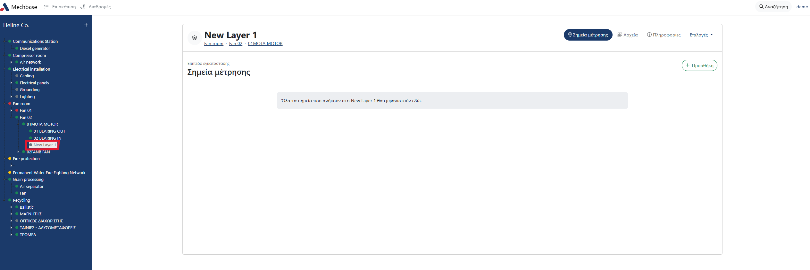

2.2 Επεξεργασία επιπέδου εγκατάστασης
^^^^^^^^^^^^^^^^^^^^^^^^^^^^^^^^^^^^^^

Περιηγηθείτε στο επίπεδο το οποίο θέλετε να επεξεργαστείτε. 

Από το μενού κλικάρετε "Επεξεργασία".

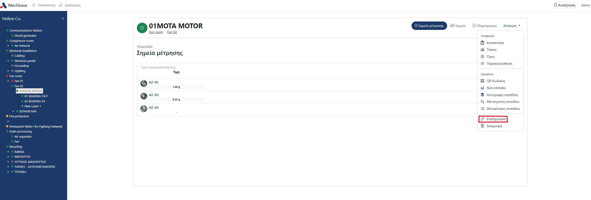

Αλλάζετε τα στοιχεία που θέλετε και κλικάρετε "Αποθήκευση αλλαγών".

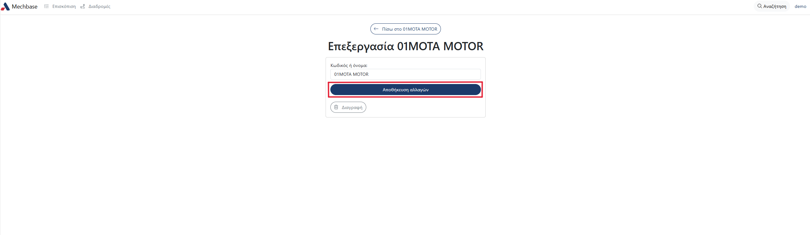

2.3 Αντίγραφο επιπέδου εγκατάστασης
^^^^^^^^^^^^^^^^^^^^^^^^^^^^^^^^^^^
Περιηγηθείτε στο επίπεδο για το οποίο θέλετε να δημιουργήσετε αντίγραφο.

Από το μενού κλικάρετε "Αντιγραφή επιπέδου".

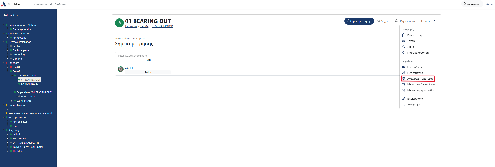

Στη συνέχεια, συμπληρώνετε το όνομα "Κωδικός ή όνομα" και τον "Γονέα".

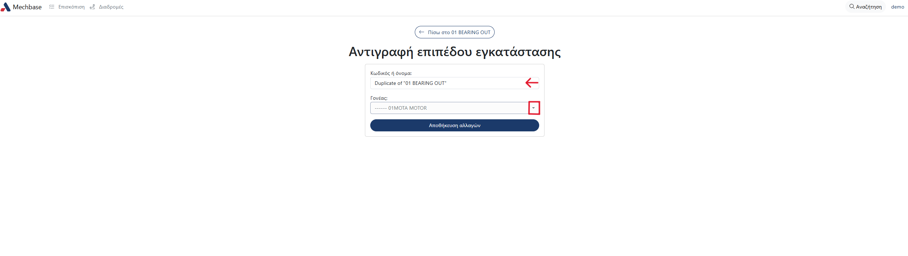

To αντίγραφο το βλέπετε απο κάτω απο το επίπεδο που αντιγράψατε με το όνομα του επιπέδου και τη φράση 'Duplicate of'.

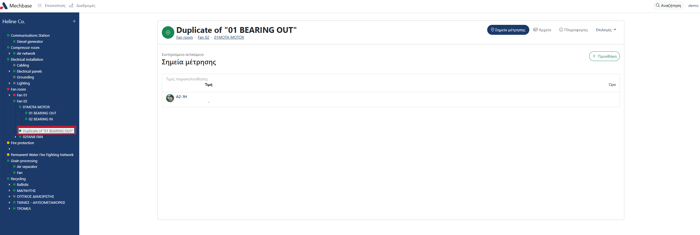

2.4 Αναφορές
^^^^^^^^^^^^

Για να δείτε τις αναφορές ενός επιπέδου εγκατάστασης, περιηγηθείτε στην εγκατάσταση που σας ενδιαφέρει, είτε απο το δέντρο είτε απο την αρχική σελίδα της πλατφόρμας, και κλικάρετε στο "Επιλογές".

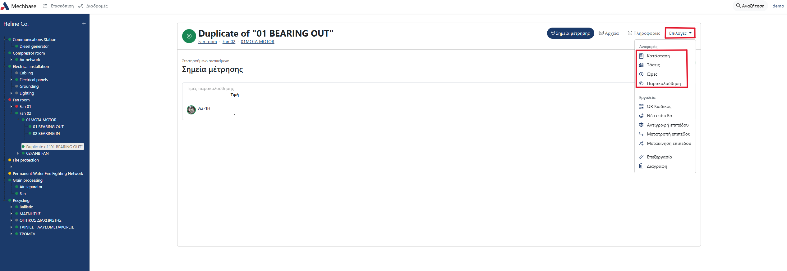

Κατάσταση
******

Η Κατάσταση σας δείχνει τις αναφορές κατάστασης των μετρήσεων, το όνομα του εξοπλισμού, τις τιμές, σχόλια αν υπάρχουν και την κατάσταση.

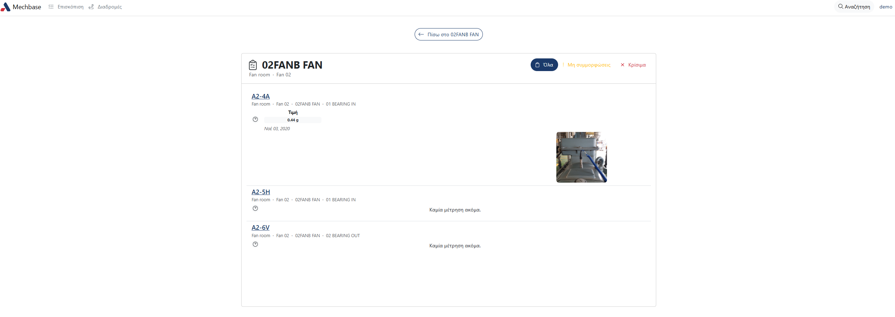

Κλικάροντας μία από τις δύο επιλογές στο πάνω δεξιά μέρος της οθόνης εφαρμόζετε φίτρο που σας επιτρέπει να δείτει τις μετρήσεις που έχουν ανατεθεί
"Μη συμμορφώσεις" ή κάποια άλλη κατάσταση. Η προκαθορισμένη επιλογή είναι η εμφάνιση όλων των μετρήσεων.

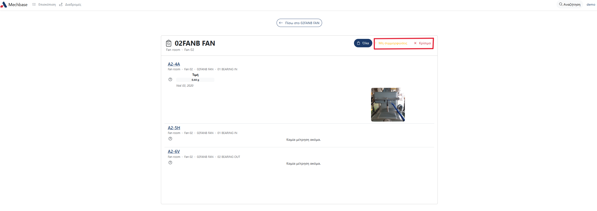

Τάσεις
******

Στις τάσεις μπορείτε να δείτε τις μετρήσεις των μηχανημάτων σε μορφή διαγράμματος. 

Κλικάρετε την επιλογή "Τάσεις" και μια νέα οθόνη θα εμφανιστεί με γραφήματα για το κάθε μηχάνημα, αν υπάρχουν.

Πάνω, βλέπετε τις προκαθορισμένες ημερομηνίες για την εμφάνιση των γραφημάτων. 

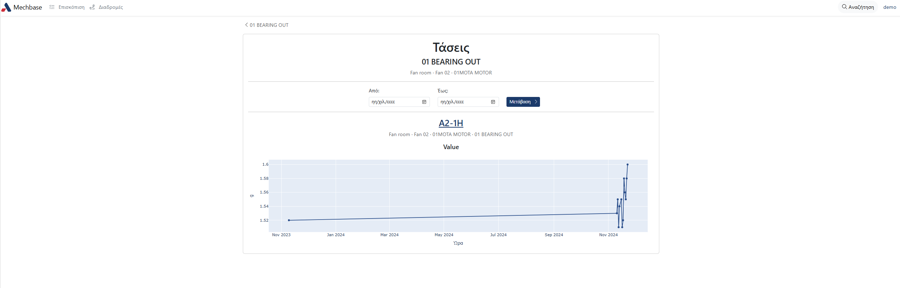

Για την εμφάνιση γραφημάτων συγκεκριμένων ημερομηνιών, σείρετε το ποντίκι πάνω απο πρώτο πεδίο ημερομηνίας. 

Είτε πληκτρολογήστε την ημερομηνία στο πεδίο είτε κλικάρετε το εικονίδιο ημερολογίου για να εμφανιστεί το ημέρολόγιο απ' όπου μπορείτε να επιλέξετε προηγούμενους μήνες. Από εκεί, με τα βελάκια επιλέγετε το μήνα.

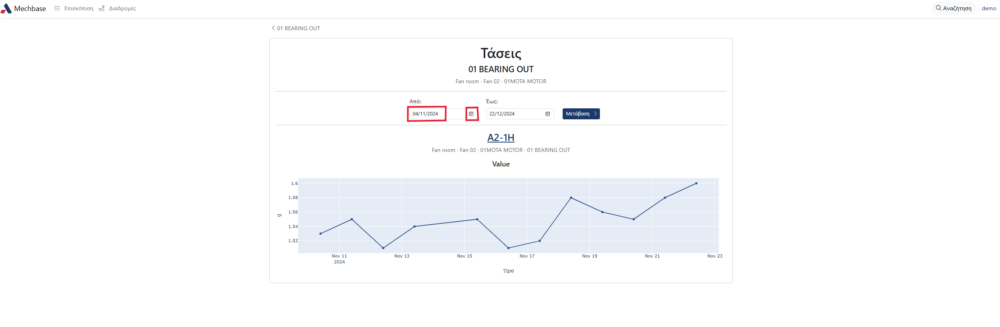

Επαναλάβετε την ίδια διαδικασία στο δεύτερο πεδίο ημερομηνίας, για να επιλέξετε μέχρι ποια ημέρα καταγραφής θα εμφανιστεί.

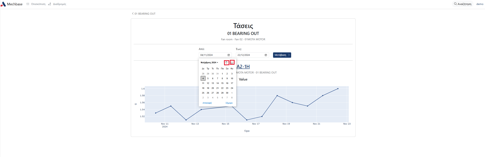

Κλικάρετε "Μετάβαση" για να δείτε τις μετρήσεις για τις ημερομηνίες που επιλέξατε.

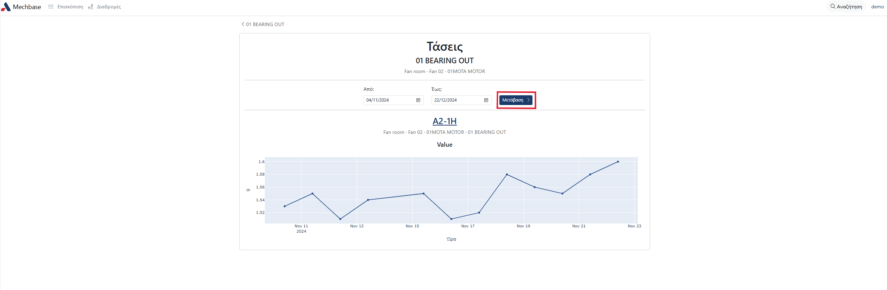

Στις Τάσεις δεν υπάρχουν μετρήσεις ωρομετρητών.

Hours
*****

Στην οθόνη αυτή μπορείτε να δείτε τη λίστα με το πόσες ώρες έχει λειτουργήσει συνολικά ο κάθε εξοπλισμός μιας εγκατάστασης.

Για την εμφάνιση συγκεκριμένων ημερομηνιών ακολουθήστε την ίδια διαδικασία με αυτή που περιγράφεται στις τάσεις.

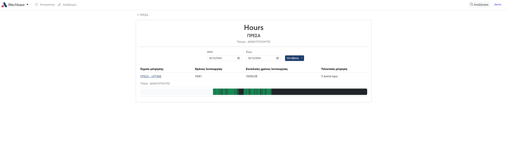

Για να δείτε λεπτομεριακά τις ώρες λειτουργίας ενός από τους εξοπλισμούς, κλικάρετε στο όνομα του εξοπλισμού.

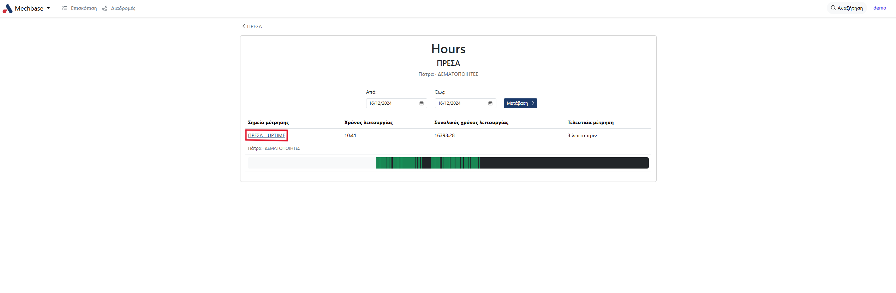

Στη νέα οθόνη που εμφανίζεται, βλέπετε το γράφημα των ωρών λειτουργίας και μη λειτουργίας του εξοπλισμού, και τη λίστα με τις ημερομηνίες και ώρες που ο εξοπλισμός λειτουργούσε ή όχι.

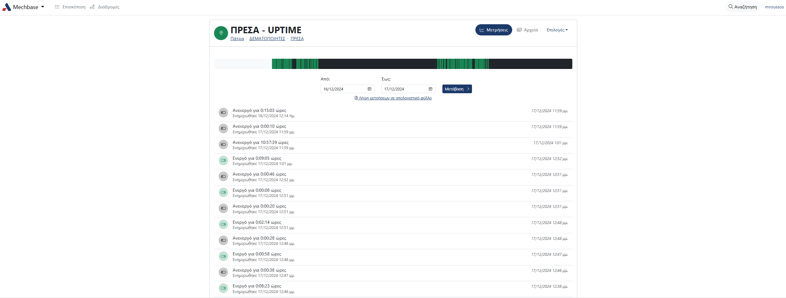

