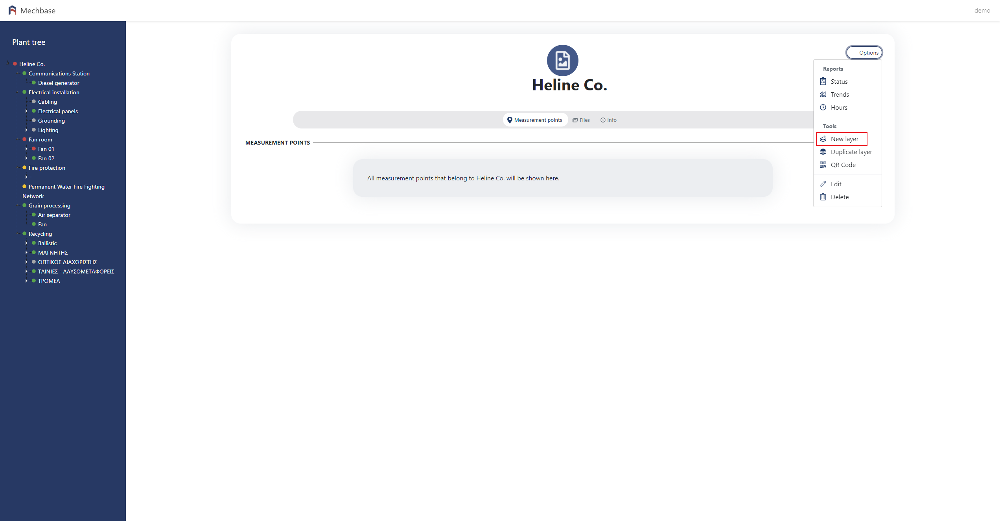
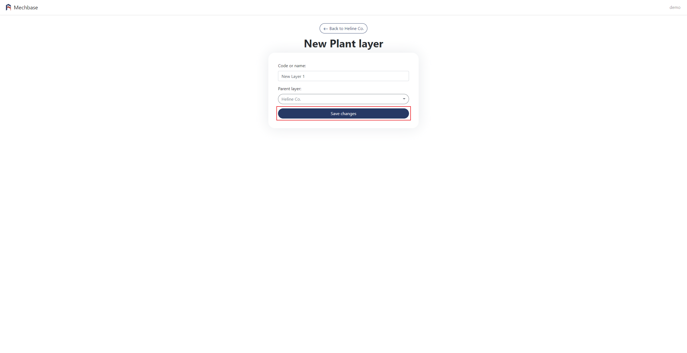

2. Δομή
=======

2.1 Δημιουργία νέου επιπέδου εγκατάστασης
^^^^^^^^^^^^^^^^^^^^^^^^^^^^^^^^^^^^^^^^^

Περιηγηθείτε στο επίπεδο το οποίο θα είναι 'πρόγονος' του νέου επιπέδου. 

Από το μενού κλικάρετε New Layer.

Επιλέξτε τον τύπο επιπέδου που θέλετε να δημιουργήσετε.

.. image:: Plant-Layer/Create-plant-layer-2.png

Συμπληρώνετε το όνομα 'Name' και το 'Parent layer'.

Μόλις τα συμπληρώσετε κλικάρετε 'Save changes'.

Από το δέντρο περιηγείστε στο νέο επίπεδο.

2.2 Επεξεργασία επιπέδου εγκατάστασης
^^^^^^^^^^^^^^^^^^^^^^^^^^^^^^^^^^^^^^

Περιηγηθείτε στο επίπεδο το οποίο θέλετε να επεξεργαστείτε. 

Από το μενού κλικάρετε 'Edit'.

Αλλάζετε τα στοιχεία που θέλετε και κλικάρετε 'Save changes'.

.. image:: Plant-Layer/Edit-plant-layer-2.png

2.3 Μετακίνηση επιπέδου εγκατάστασης
^^^^^^^^^^^^^^^^^^^^^^^^^^^^^^^^^^^^

Περιηγηθείτε στο επίπεδο το οποίο θέλετε να μετακινήσετε σε έναν 'απόγονο' επίπεδου εγκατάστασης.

Από το μενού κλικάρετε Plant layer και στη συνέχεια 'Move'.

.. image:: Plant-Layer/Move-plant-layer-1.png

Στη φόρμα που εμφανίζεται, κλικάρετε το βελάκι και στο πλαίσιο “Search” πληκτρολογείτε το επίπεδο στο οποίο θέλετε να μετακινήσετε το παρον επίπεδο εγκατάστασης. 

Απο κάτω θα εμφανιστεί το όνομα του επίπεδου που πληκτρολογήσατε. Το κλικάρετε και πατάτε 'Submit'.

.. image:: Plant-Layer/Move-plant-layer-2.png

.. image:: Plant-Layer/Move-plant-layer-3.png

.. image:: Plant-Layer/Move-plant-layer-4.png

2.4 Αντίγραφο επιπέδου εγκατάστασης
^^^^^^^^^^^^^^^^^^^^^^^^^^^^^^^^^^^
Περιηγηθείτε στο επίπεδο για το οποίο θέλετε να δημιουργήσετε αντίγραφο.

Από το μενού κλικάρετε Plant layer και στη συνέχεια 'Duplicate'.

.. image:: Plant-Layer/Duplicate-plant-layer-1.png

Συμπληρώνετε το όνομα 'Name' και το 'Parent layer'.

.. image:: Plant-Layer/Duplicate-plant-layer-2.png

To αντίγραφο το βλέπετε απο κάτω απο το επίπεδο που αντιγράψατε με το όνομα του επιπέδου και τη φράση 'Duplicate of'.

.. image:: Plant-Layer/Duplicate-plant-layer-3.png

2.5 Αναφορές
^^^^^^^^^^^^

Για να δείτε τις αναφορές ενός επιπέδου εγκατάστασης, περιηγηθείτε στην εγκατάσταση που σας ενδιαφέρει, είτε απο το δέντρο είτε απο την αρχική σελίδα της πλατφόρμας, και κλικάρετε στο 'Options'.

.. image:: Reports/Reports-1.png

.. image:: Reports/Reports-2.png

Status
******

To Status σας δείχνει τις αναφορές κατάστασης των μετρήσεων, το όνομα του εξοπλισμού, τις τιμές, σχόλια αν υπάρχουν και την κατάσταση.

Στο πρώτο πεδίο πληκτρολογείτε την ημερομηνία σε μορφή D/M/YYYY ή κλικάρετε το εικονίδιο δεξιά του πεδίου για να επιλέξετε ημερομηνία απο την οποία θέλετε να εμφανιστούν οι αναφορές.

Στο ημερολόγιο που θα εμφανιστεί, επιλέξτε μήνα με τα βελάκια δεξια/αριστερά και ημέρα. Αν θέλετε να ξεκινούν οι αναφορές απο τη σημερινή μέρα, κλικάρετε 'Today'.

Επαναλάβετε την ίδια διαδικασία για το δέυτερο πεδίο, για να επιλέξετε την τελευταία ημερομηνία αναφορών που επιθυμείτε.

.. image:: Reports/Reports-8.png

Στο τελευταίο πεδίο, η προκαθορισμένη επιλογή είναι η εμφάνιση όλων των μετρήσεων.
Για να επιλέξετε τις μετρήσεις που έχουν ανατεθεί 'Good' ή οποιαδήποτε κατάσταση, κάντε κλικ στο βελάκι,
και στη συνέχεια στην επιλογή 'Measurements with status Good or worse'.

Στη συνέχεια κλικάρετε 'Update report'.

Για τον καθαρισμό της φόρμας, κλικάρετε 'Clear'.

Αν θέλετε να κατεβάσετε στον υπολογιστή σας την αναφορά, κλικάρετε στο εικονίδιο αριστερά απο το κουμπί
'Clear'.

.. image:: Reports/Reports-10.png

Trends
******

Στα trends μπορείτε να δείτε τις μετρήσεις των μηχανημάτων σε μορφή διαγράμματος. 

Κλικάρετε την επιλογή 'Trends' και μια νέα οθόνη θα εμφανιστεί με γραφήματα για το κάθε μηχάνημα, άν υπάρχουν.

Πάνω, βλέπετε τις προκαθορισμένες ημερομηνίες για την εμφάνιση των γραφημάτων. 

Για την εμφάνιση γραφημάτων συγκεκριμένων ημερομηνιών, σείρετε το ποντίκι πάνω απο πρώτο πεδίο ημερομηνίας. 

Είτε πληκτρολογήστε την ημερομηνία στο πεδίο είτε κλικάρετε το εικονίδιο ημερολογίου για να εμφανιστεί το ημέρολόγιο απο όπου μπορείτε να επιλέξετε προηγούμενους μήνες. Απο εκεί, με τα βελάκια επιλέγετε το μήνα.

.. image:: Reports/Reports-4.png

Επαναλάβετε την ίδια διαδικασία στο δεύτερο πεδίο ημερομηνίας, για να επιλέξετε μέχρι ποιά ημέρα καταγραφής θα εμφανιστεί.

.. image:: Reports/Reports-5.png

Κλικάρετε 'Go' για να δείτε τις μετρήσεις για τις ημερομηνίες που επιλέξατε.

.. image:: Reports/Reports-6.png

Στα Trends δεν υπάρχουν μετρήσεις ωρομετρητών.

Hours
*****

Στην οθόνη αυτή μπορείτε να δείτε τη λίστα με το πόσες ώρες έχει λειτουργήσει συνολικά ο κάθε εξοπλισμός μιας εγκατάστασης.

.. image:: Reports/Reports-11.png

Για να δείτε λεπτομεριακά τις ώρες λειτουργίας ενός απο τους εξοπλισμούς, κλικάρετε στο όνομα του εξοπλισμού.

.. image:: Reports/Reports-12.png

Στη νέα οθόνη που εμφανίζεται, βλέπετε το γράφημα των ωρών λειτουργίας και μή λειτουργίας του εξοπλισμού, και τη λίστα με τις ημερομηνίες και ώρες που ο εξοπλισμός λειτουργούσε ή όχι.

.. image:: Reports/Reports-13.png

.. image:: Reports/Reports-14.png

