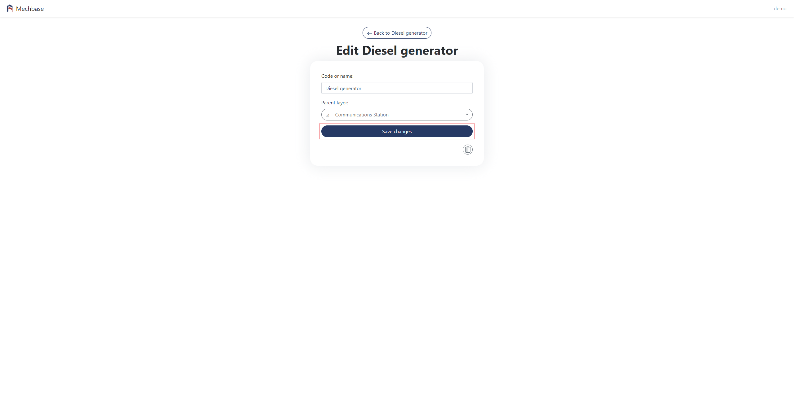
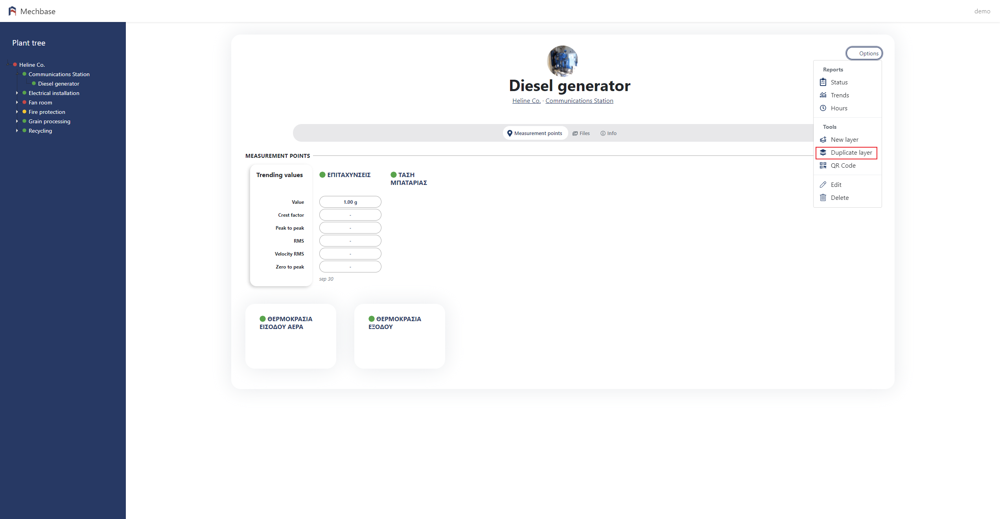
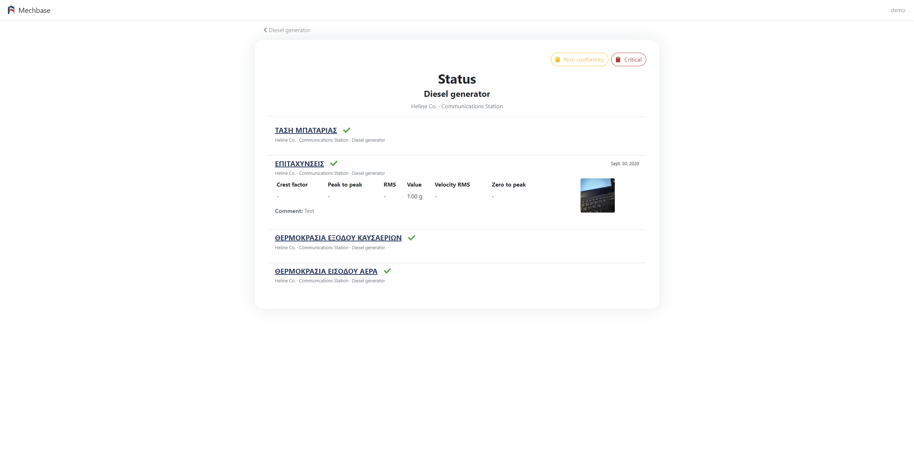
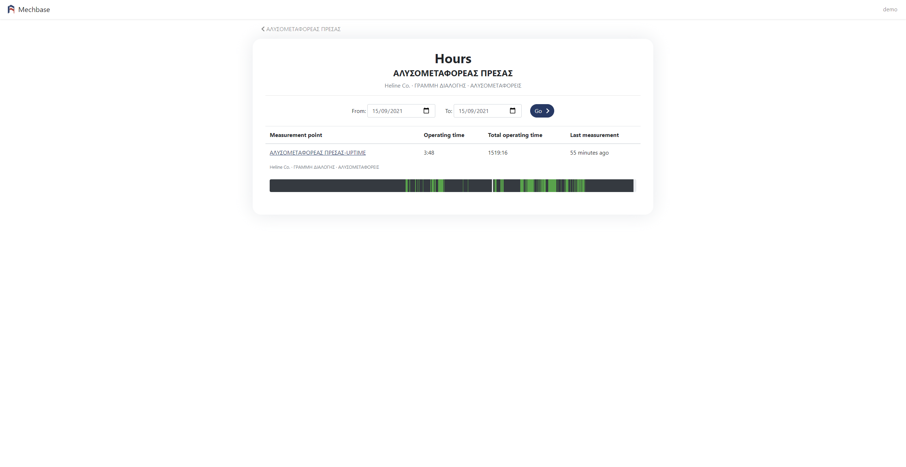
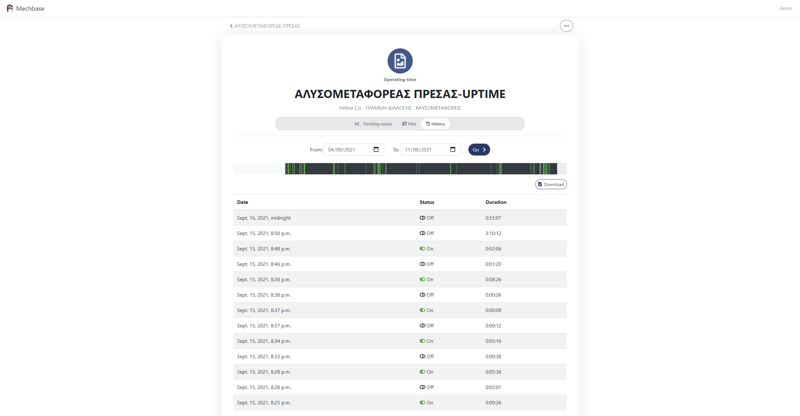

2. Δομή
=======

2.1 Δημιουργία νέου επιπέδου εγκατάστασης
^^^^^^^^^^^^^^^^^^^^^^^^^^^^^^^^^^^^^^^^^

Περιηγηθείτε στο επίπεδο το οποίο θα είναι 'πρόγονος' του νέου επιπέδου. 

Από το μενού κλικάρετε New Layer.

.. image:: Plant-Layer/Create-plant-layer-1.png

Επιλέξτε τον τύπο επιπέδου που θέλετε να δημιουργήσετε.

Συμπληρώνετε το όνομα 'Name' και το 'Parent layer'.

.. image:: Plant-Layer/Create-plant-layer-3.png

Μόλις τα συμπληρώσετε κλικάρετε 'Save changes'.

.. image:: Plant-Layer/Create-plant-layer-4.png

Από το δέντρο περιηγείστε στο νέο επίπεδο.

.. image:: Plant-Layer/Create-plant-layer-5.png

2.2 Επεξεργασία επιπέδου εγκατάστασης
^^^^^^^^^^^^^^^^^^^^^^^^^^^^^^^^^^^^^^

Περιηγηθείτε στο επίπεδο το οποίο θέλετε να επεξεργαστείτε. 

Από το μενού κλικάρετε 'Edit'.

.. image:: Plant-Layer/Edit-plant-layer-1.png

Αλλάζετε τα στοιχεία που θέλετε και κλικάρετε 'Save changes'.

2.3 Αντίγραφο επιπέδου εγκατάστασης
^^^^^^^^^^^^^^^^^^^^^^^^^^^^^^^^^^^
Περιηγηθείτε στο επίπεδο για το οποίο θέλετε να δημιουργήσετε αντίγραφο.

Από το μενού κλικάρετε Plant layer και στη συνέχεια 'Duplicate'.

Συμπληρώνετε το όνομα 'Name' και το 'Parent layer'.

To αντίγραφο το βλέπετε απο κάτω απο το επίπεδο που αντιγράψατε με το όνομα του επιπέδου και τη φράση 'Duplicate of'.

.. image:: Plant-Layer/Duplicate-plant-layer-3.png

2.4 Αναφορές
^^^^^^^^^^^^

Για να δείτε τις αναφορές ενός επιπέδου εγκατάστασης, περιηγηθείτε στην εγκατάσταση που σας ενδιαφέρει, είτε απο το δέντρο είτε απο την αρχική σελίδα της πλατφόρμας, και κλικάρετε στο 'Options'.

.. image:: Reports/Reports-1.png

Status
******

To Status σας δείχνει τις αναφορές κατάστασης των μετρήσεων, το όνομα του εξοπλισμού, τις τιμές, σχόλια αν υπάρχουν και την κατάσταση.

Κλικάροντας μία από τις δύο επιλογές στο πάνω δεξιά μέρος της οθόνης εφαρμόζετε φίτρο που σας επιτρέπει να δείτει τις μετρήσεις που έχουν ανατεθεί
'Non comformity' ή κάποια άλλη κατάσταση. Η προκαθορισμένη επιλογή είναι η εμφάνιση όλων των μετρήσεων.

.. image:: Reports/Reports-9.png

Trends
******

Στα trends μπορείτε να δείτε τις μετρήσεις των μηχανημάτων σε μορφή διαγράμματος. 

Κλικάρετε την επιλογή 'Trends' και μια νέα οθόνη θα εμφανιστεί με γραφήματα για το κάθε μηχάνημα, άν υπάρχουν.

Πάνω, βλέπετε τις προκαθορισμένες ημερομηνίες για την εμφάνιση των γραφημάτων. 

.. image:: Reports/Reports-3.png

Για την εμφάνιση γραφημάτων συγκεκριμένων ημερομηνιών, σείρετε το ποντίκι πάνω απο πρώτο πεδίο ημερομηνίας. 

Είτε πληκτρολογήστε την ημερομηνία στο πεδίο είτε κλικάρετε το εικονίδιο ημερολογίου για να εμφανιστεί το ημέρολόγιο απο όπου μπορείτε να επιλέξετε προηγούμενους μήνες. Απο εκεί, με τα βελάκια επιλέγετε το μήνα.

Επαναλάβετε την ίδια διαδικασία στο δεύτερο πεδίο ημερομηνίας, για να επιλέξετε μέχρι ποιά ημέρα καταγραφής θα εμφανιστεί.

.. image:: Reports/Reports-5.png

Κλικάρετε 'Go' για να δείτε τις μετρήσεις για τις ημερομηνίες που επιλέξατε.

Στα Trends δεν υπάρχουν μετρήσεις ωρομετρητών.

Hours
*****

Στην οθόνη αυτή μπορείτε να δείτε τη λίστα με το πόσες ώρες έχει λειτουργήσει συνολικά ο κάθε εξοπλισμός μιας εγκατάστασης.

Για την εμφάνιση συγκεκριμένων ημερομηνιών ακολουθήστε την ίδια διαδικασία με αυτή που περιγράφεται στα trends.

Για να δείτε λεπτομεριακά τις ώρες λειτουργίας ενός απο τους εξοπλισμούς, κλικάρετε στο όνομα του εξοπλισμού.

Στη νέα οθόνη που εμφανίζεται, βλέπετε το γράφημα των ωρών λειτουργίας και μή λειτουργίας του εξοπλισμού, και τη λίστα με τις ημερομηνίες και ώρες που ο εξοπλισμός λειτουργούσε ή όχι.

