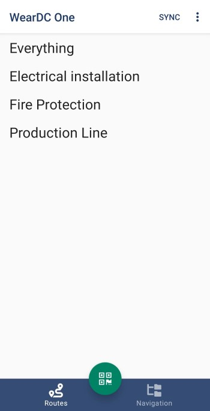

Εισαγωγή
============

Η εφαρμογή του WearDC σας δίνει τη δυνατότητα να έχετε πρόσβαση στις εγκαταστάσεις σας μέσω της κινητής σας συσκευής.

Μπορείτε να εγκαταστήσετε την εφαρμογή από τον υπολογιστή σας στον σύνδεσμο https://play.google.com/store/apps/details?id=com.arpedon.weardc&hl=en_US ή από την εφαρμογή Google Play στο κινητό σας γράφοντας WEARDC One στην γραμμή αναζήτησης και στη συνέχεια πατώντας το κουμπί 'Εγκατάσταση'.

Από την αρχική οθόνη μπορείτε άμεσα να δείτε τις διαδρομές που έχετε ορίσει, την πλήρη λίστα των εγκαταστάσεων και να σκανάρετε QR κωδικούς.

