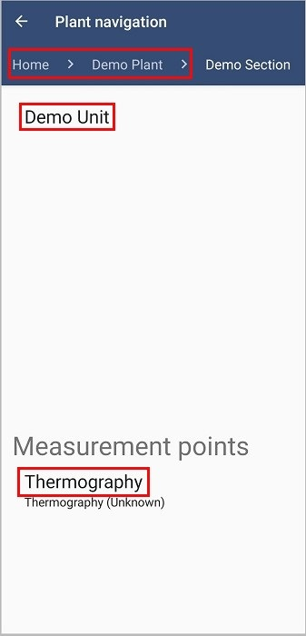

Πλοήγηση
==========

Για να δείτε τη λίστα με τις εγκαταστάσεις, πατήστε το κουμπί ‘Πλοήγηση’.

.. image:: Navigation/navigation.jpg

Από την οθόνη με τη λίστα των εγκαταστάσεων πατήστε την εγκατάσταση που σας ενδιαφέρει και στη συνέχεια, μπορείτε να δείτε τις επιμέρους εγκαταστάσεις, αν υπάρχουν, και τα σημεία μέτρησης, πατώντας την ονομασία τους σε κάθε νέα οθόνη που εμφανίζετε.

Στο πάνω μέρος της οθόνης φαίνονται τα επίπεδα μέσα στην εγκατάσταση. Μπορείτε να πάτε σε προηγούμενο επίπεδο πατώντας πάνω στο όνομα.

Πατώντας το όνομα του σημείου μέτρησης, μεταφέρεστε στην οθόνη με στο σημείο μέτρησης.

Σε κάθε σημείο μέτρησης μπορείτε να ανεβάσετε φωτογραφία(1), να προσθέσετε μια τιμή στο πεδίο ‘Add the value here’(2), να γράψετε κάποια σημείωση στο πεδίο ‘Add an observation here’(3) και να ανεβάσετε μια θερμογραφία(αν το σημείο μέτρησης είναι θερμογραφία) ή φωτογραφία(αν θέλετε να κρατήσετε κάποια σημείωση σε μορφή φωτογραφίας)(4). Όταν ολοκληρώσετε οποιαδήποτε προσθήκη, πατήστε το κουμπί ‘Save’(5). Για να δείτε τα επόμενα σημεία μέτρησης, πατήστε τα βελάκια στο κάτω μέρος της οθόνης(6) ή σύρετε την οθόνη αριστερά.

Για να ανεβάσετε φωτογραφία, πατήστε το κουμπί(1). Στην επόμενη οθόνη η φωτογράφία που εμφανίζεται είναι η πιο πρόσφατη. Σύροντας την οθόνη προς τα αριστερά, μπορείτε να δείτε όλες τις αποθηκευμένες φωτογραφίες. Πατώντας το κουμπί με την φωτογραφική μηχανή, η κάμερα του κινητού σας θα ανοίξει και μπορείτε να βγάλετε φωτογραφία το σημείο. Αν είσαστε ευχαριστημένοι με τη φωτογραφία πατήστε 'OK' για να αποθηκευτεί, αλλιώς πατήστε 'Επανάληψη' για να ξανατραβήξετε φωτογραφία.

.. image:: Navigation/mp.jpg

Στο πεδίο 2, αν το σημείο μέτρησης δέχεται τιμή Optical boolean, επιλέξετε true ή false.

 .. image:: Navigation/navigation-ob.jpg

Σημείωση: Για να μπορέσετε να ανεβάσετε μια θερμογραφία θα πρέπει η συσκευή σας να είναι συνδεδεμένη με την κάμερα Flir One.

