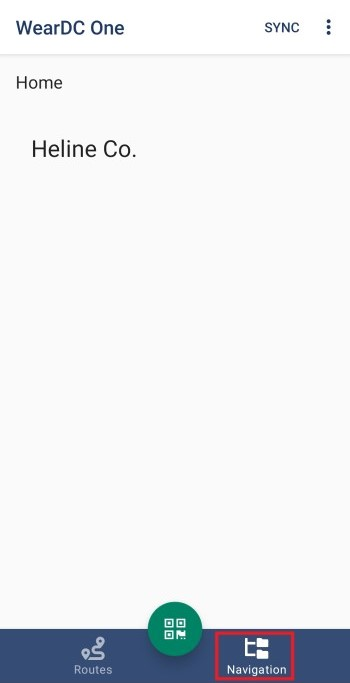
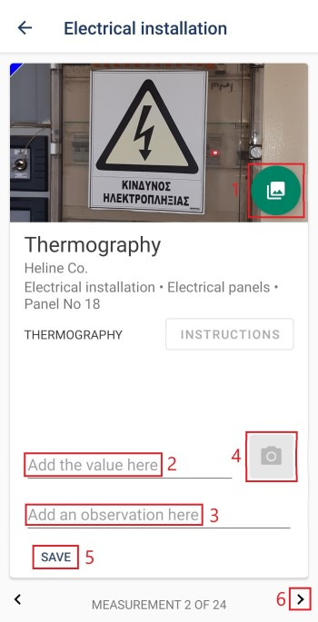

Πλοήγηση
==========

Για να δείτε τη λίστα με τις εγκαταστάσεις, πατήστε το κουμπί ‘Πλοήγηση’.

Από την οθόνη με τη λίστα των εγκαταστάσεων πατήστε την εγκατάσταση που σας ενδιαφέρει και στη συνέχεια, μπορείτε να δείτε τις επιμέρους εγκαταστάσεις, αν υπάρχουν, και τα σημεία μέτρησης, πατώντας την ονομασία τους σε κάθε νέα οθόνη που εμφανίζετε.

Σε κάθε σημείο μέτρησης μπορείτε να ανεβάσετε φωτογραφία(1), να προσθέσετε μια τιμή στο πεδίο ‘Add the value here’(2), να γράψετε κάποια σημείωση στο πεδίο ‘Add an observation here’(3) και να ανεβάσετε μια θερμογραφία(4). Όταν ολοκληρώσετε οποιαδήποτε προσθήκη, πατήστε το κουμπί ‘Save’(5). Για να δείτε τα επόμενα σημεία μέτρησης, πατήστε τα βελάκια στο κάτω μέρος της οθόνης(6).

 
Σημείωση: Για να μπορέσετε να ανεβάσετε μια θερμογραφία θα πρέπει η συσκευή σας να είναι συνδεδεμένη με την κάμερα Flir One.

