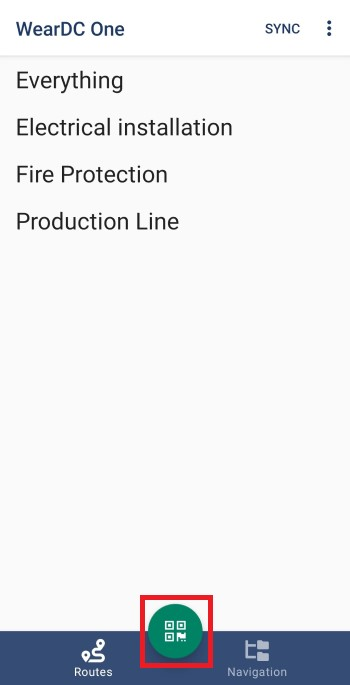

Σάρωση QR
==========

Για να σκανάρετε κωδικό QR ενός παγίου, πατήστε το κουμπί ‘Σάρωση’.

Στη συνέχεια, κεντράρετε τον κωδικό μέσα στο πλαίσιο που εμφανίζετε στην οθόνη σας και ο κωδικός θα σκαναριστεί αυτόματα. Αν ο κωδικός αυτός έχει ανατεθεί σε κάποιο πάγιο, αυτό θα εμφανιστεί στην οθόνη σας.

 .. image:: Qr/qr.jpg

Αν ο κωδικός αυτός έχει ανατεθεί σε κάποιο πάγιο, θα ακουστεί ένας ήχος και το σημείο μέτρησης θα εμφανιστεί στην οθόνη σας.

 .. image:: Qr/qr-mp.jpg

 