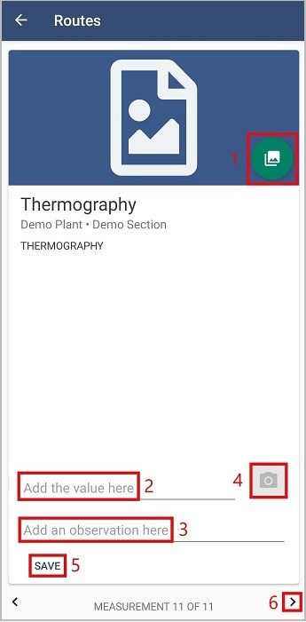
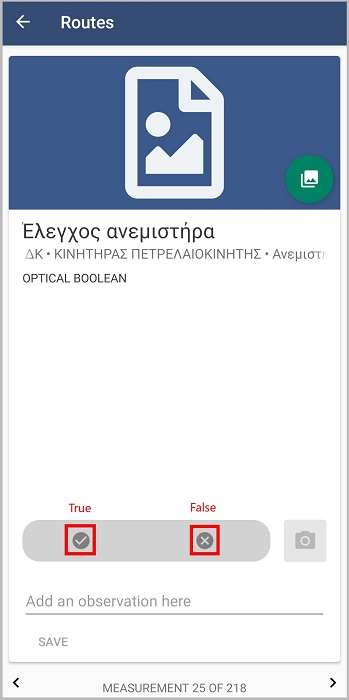

Διαδρομές
==========

Για να δείτε τις διαδρομές, πατήστε το κουμπί Διαδρομές. 

.. image:: Routes/routes1.jpg

Στη συνέχεια από την οθόνη που θα εμφανιστεί πατήστε τη διαδρομή που σας ενδιαφέρει και θα μεταφερθείτε στην οθόνη με το πρώτο σημείο μέτρησης της διαδρομής. 

.. image:: Routes/routes2.jpg

Σε κάθε σημείο μέτρησης μέσα σε μια διαδρομή, μπορείτε να ανεβάσετε φωτογραφία(1), να προσθέσετε μια τιμή στο πεδίο ‘Add the value here’(2), να γράψετε κάποια σημείωση στο πεδίο ‘Add an observation here’(3) και να ανεβάσετε μια θερμογραφία(αν το σημείο μέτρησης είναι θερμογραφία) ή φωτογραφία(αν θέλετε να κρατήσετε κάποια σημείωση σε μορφή φωτογραφίας)(4). Όταν ολοκληρώσετε οποιαδήποτε προσθήκη, πατήστε το κουμπί ‘Save’(5). Για να δείτε τα επόμενα σημεία μέτρησης, πατήστε τα βελάκια στο κάτω μέρος της οθόνης(6) ή σύρετε την οθόνη αριστερά.

Για να ανεβάσετε φωτογραφία, πατήστε το κουμπί(1). Στην επόμενη οθόνη η φωτογραφία που εμφανίζεται είναι η πιο πρόσφατη. Σύροντας την οθόνη προς τα αριστερά, μπορείτε να δείτε όλες τις αποθηκευμένες φωτογραφίες. Πατώντας το κουμπί με την φωτογραφική μηχανή, η κάμερα του κινητού σας θα ανοίξει και μπορείτε να βγάλετε φωτογραφία το σημείο. Αν είσαστε ευχαριστημένοι με τη φωτογραφία πατήστε 'OK' για να αποθηκευτεί, αλλιώς πατήστε 'Επανάληψη' για να ξανατραβήξετε φωτογραφία.

Στο πεδίο 2, αν το σημείο μέτρησης δέχεται τιμή Optical boolean, επιλέξετε true ή false.

Για να επιστρέψετε στη λίστα των διαδρομών, πατήστε το βελάκι που βρίσκεται πάνω αριστερά.

.. image:: Routes/routes-arrow.jpg

Όταν ολοκληρώσετε μια διαδρομή, πατήστε 'Sync' από την αρχική οθόνη για συγχρονισμό των δεδομένων.

Σημείωση: Για να μπορέσετε να ανεβάσετε μια θερμογραφία θα πρέπει η συσκευή σας να είναι συνδεδεμένη με την κάμερα Flir One

