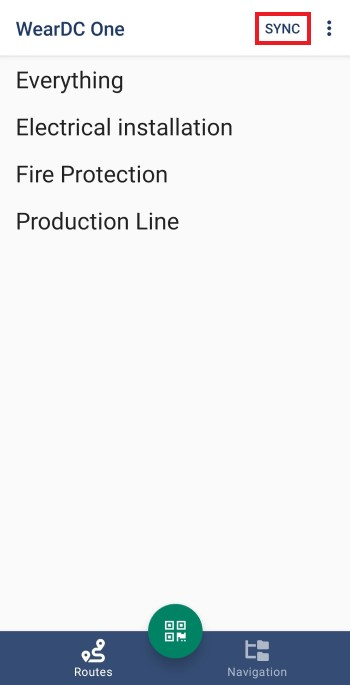
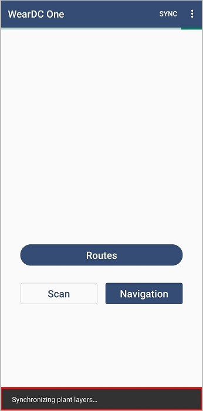

Συγχρονισμός
=============

Η εφαρμογή διαθέτει κουμπί συγχρονισμού με τη βάση δεδομένων. Σε περίπτωση που έχουν γίνει αλλαγές από την τελευταία φορά που ανοίξατε την εφαρμογή και δεν βρίσκετε διαδρομές, εγκαταστάσεις ή σημεία μέτρησης μέσω της εφαρμογής, πρέπει να πατήσετε το κουμπί ‘Sync’ για να συγχρονιστεί η εφαρμογή με τη βάση δεδομένων. Η ίδια διαδικασία πρέπει να γίνει αν συνδεθείτε με διαφορετικό λογαριασμό.
O χρόνος της διαδικασία συγχρονισμού εξαρτάται από το μέγεθος των πληροφοριών  που καλείτε να ‘κατεβάσει’ η συσκευή.

Κατά τη διάρκεια του συγχρονισμού, αναγράφεται στο κάτω μέρος της εφαρμογής ποια πληροφορία αναβαθμίζεται. 

Όταν ολοκληρωθεί ο συγχρονισμός εμφανίζεται το μήνυμα ΄Sync completed’.

.. image:: Sync/sync-completed.jpg
