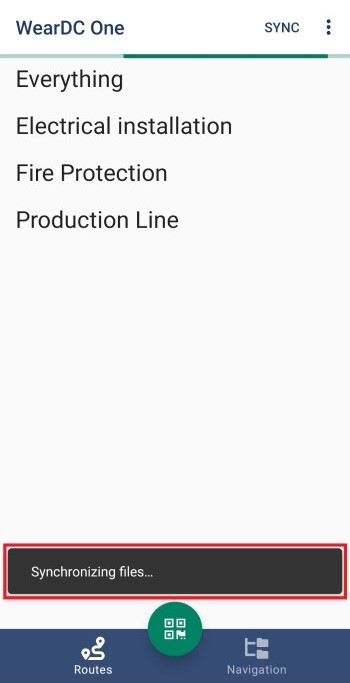
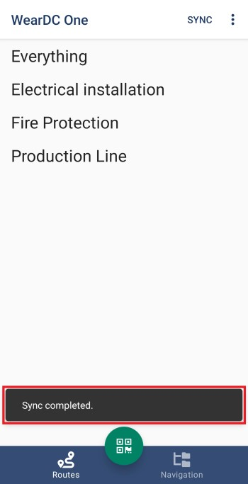

Συγχρονισμός
=============

Η εφαρμογή διαθέτει κουμπί συγχρονισμού με τη βάση δεδομένων. Kατά την προετοιμασία για να βγείτε στο πεδίο για μέτρηση και ενώ βρίσκεστε σε δίκτυο wifi, πατήστε το κουμπί 'Sync' για να ενημερωθούν τα δεδομένα(σημεία, διαδρομές, επίπεδα).

.. image:: Sync/sync-button.jpg

Κατά τη διάρκεια του συγχρονισμού, αναγράφεται στο κάτω μέρος της εφαρμογής ποια πληροφορία αναβαθμίζεται. 

Όταν ολοκληρωθεί ο συγχρονισμός εμφανίζεται το μήνυμα ΄Sync completed’.

O χρόνος της διαδικασία συγχρονισμού εξαρτάται από το μέγεθος των πληροφοριών που καλείτε να ‘κατεβάσει’ η συσκευή.

